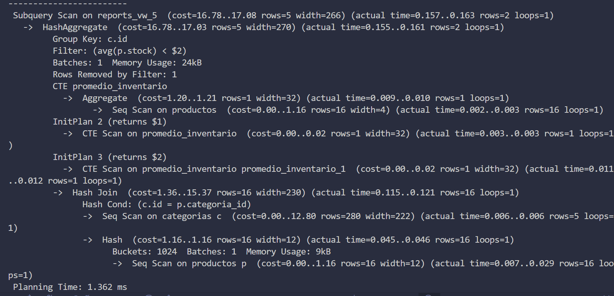
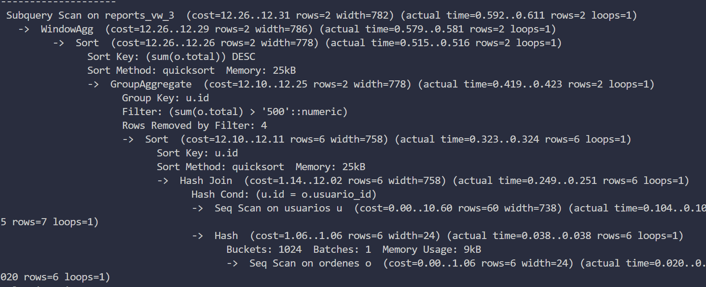

## DASHBOARD E-COMMERCE BASICO 
Esta practica se trata de una pagina que funciona como reportes sobre una base de datos desarrollada con **Next.js** y **PostgreSQL**.
El propósito de esta práctica es experimentar con views e índices en PostgreSQL dentro de un entorno Docker, aplicándolos a un sistema de reportes construido con Next.js para analizar y optimizar el acceso a los datos.

### Stack Tecnológico 
* **Frontend/Framework:** Next.js 15 (App Router).
* **Base de Datos:** PostgreSQL (Dockerizado).
* **Validación de Datos:** Zod (Esquemas estrictos para URL params y tipos).
* **Visualización:** Recharts (Gráficos interactivos).
* **Estilos:** Tailwind CSS.
* **Lenguaje:** TypeScript.

## Instalacion y Despliegue 
Este proyecto está contenerizado para facilitar su despliegue.
Utiliza **Docker Compose** para orquestar tanto la aplicación (Frontend/Backend en Next.js) como la base de datos (PostgreSQL) simultáneamente.

### 1. Prerrequsisito 
* Tener instalado [Docker Desktop](https://www.docker.com/).
* Gitbash.
### 2. clona el repositorio 
```bash
git clone <TU_URL_DEL_REPO>
cd <NOMBRE_DE_TU_CARPETA>
```
### entrar al proyecto 
 Desde Git Bash buscas el directorio donde clonaste el repositorio para luego moverte dentro del proyecto
 ```bash
 cd ReportDashboard
 ```

### 3. Configurar Variables de Entorno
Crea un archivo `.env` en la raíz copiando el ejemplo:
```bash
cp .env-example 
```
(Asegúrate de que las credenciales en .env coincidan con las definidas en docker-compose.yml)


### levantar el contenedor
Una vez dentro del directorio que conntiene el proyecto puedes confirmar que se encuentra el archivo **docker-compose.yml**
```bash
 ls 
 ```
ejecuta el siguiente comando para levantar el contenedor 
 ```bash
 docker-compose up --build
 ```

### Mostrar Dashboard 
Una vez que la consola muestre que los servicios están listos:
Frontend/Dashboard: Abre http://localhost:3000
Base de Datos: Accesible en puerto 5432 (interno).

## Analizis de desicion tecnica DB 

###  Uso de Indices

#### idx_ordenes_total
* **Se usa en** : reports_vw_3 
* **jsutificacion** :
En esta vista se ordene los resultados por SUM(total) DESC para calcular RANK, al indexar la columna numérica total, la base de datos puede acceder a los valores ya ordenados o calcular la suma mas eficientemente. 

#### idx_ordenes_total
* **Se usa en** : reports_vw_3 
* **jsutificacion** :
En esta vista se ordene los resultados por SUM(total) DESC para calcular RANK, al indexar la columna numérica total, la base de datos puede acceder a los valores ya ordenados o calcular la suma mas eficientemente. 


## Trade-offs: SQL vs NEXT.js 

* **logica de Clasificacion**:

**SQL**
Se delego la responsabilidad a la base de datos la logica de negocio para determinar el estado textual. las vistas **reports_vw_4** y **reports_vw_2** usan CASE WHEN para devolver strings de estados como : 'ALERTA: AGOTADO' y 'Caro'

**NEXT**
la capa del cliente solo muestra estas etiquetas de clasificacion de un color con la intencion meramente visual. 

**¿Por qué?** : 
Si las reglas de negocio cambian (ej. el stock bajo pasa de 10 a 15), solo se actualiza la vista en BD, sin necesidad de recompilar el frontend ni buscar lógica dispersa en componentes de React.

* **Cálculo de totales en paginación**:

**NEXT(Server-side)**:
En 'getTopBuyers', el calculo del totalIngreso se realiza utilizando '.reduce()' sobre el array de filas obtenido. 

**¿Por qué?** : 
En este reporte para la kpi, se hizo la suma unicamente de los valores visibles en la pagina actual, evitando una segunda consulta de agregacio a la base que podria ser costos.

* **Paginacion Hibrida**:

**NEXT Y SQL**:
Next gestiona los parametros de estado  (page, pagesize) para la paginacion de los resultados de los datos, pero la ejecucuion real de los cortes de datos se hacen en SQL mediante LIMIT y OFFSET. 

**¿Por qué?** : 
En un hipoteticos caso donde se tengan que transferir  muchos registros a la memoria de Node.js para luego hacer un 'array.slice()' seria ineficiente por lo que la base de datos es mucho mas rápida descartando filas antes de enviarlas por la red. 

* **Filtrado dinamico**:

**SQL**:
En lugar de usar lógica condicional en el lado del cliente para armar 'strings' de SQL diferentes según el filtro (lo cual es riesgoso y no permitido en la actividad), se optiene una sola consulta estática y parametrizada 'WHERE ($1::text IS NULL OR status_stock = $1)' en status.ts.

**¿Por qué?** : 
Garantiza la seguridad contra SQL injection ya que el comando nunca cambia. La consulta es ligeramente mas compleja de leer pero delega eficientemente la decisión del filtrado al motor de la base de datos. 

## Performance Evidence:
* **reports_vw_5**

### explicacion: 
Lo primero que realiza es el calculo del CTE. PostgreSQL calcula primero el promedio global de stock y lo almacena temporalmente para reusalo en la comparacion. 
Lo siguiente que se realiza es la filtracion con HAVING para comparar el promedio local contra el promedio global que se calculo previamente. 
El motor utiliza **Group Key: c.id** para agrupar los productos por categoría antes de realizar el conteo y la suma de stock.

* **reports_vw_3**


### explicacion: 
La primera ejecucion que se realiza son los joins y el escaneo de los datos, la base combina las tablas usuraios y ordenes para luego escanera los datos (Seq Scan). Después agrupa los datos por usuari para luego filtrar bajo la condicion **sum(o.total) > '500'::numeric**, que confirma el HAVING que esta funcionando adecuadamente, eliminando filas despues de calcular la suma y antes de agregar el resultado.
Como paso final valida el uso de la Windows Fuction (RANK).

## Threat Model 
* **Mitigacion de SQL injection**
e erradicó la concatenación de strings en las consultas. Todas las funciones de **lib/data** utilizan _consultas parametrizadas_ (placeholders $1, $2...), delegando el escapado de inputs al driver de PostgreSQL. Esto asegura que datos como ' OR '1'='1 sean tratados como texto literal y no como código ejecutable.

* **Principio minimo de privilegios**
La aplicación Next.js no se conecta como superusuario (postgres). Se utiliza un rol específico (app_user) configurado en db/roles.sql que posee permisos estrictamente limitados: GRANT SELECT únicamente sobre las Vistas (reports_vw_*). Este usuario no tiene acceso a las tablas base (datos crudos) ni permisos para ejecutar comandos destructivos como DROP o DELETE

* **Server components**
Se utiliza la arquitectura de Server Components de Next.js (/app). La conexión a la base de datos y las credenciales (POSTGRES_PASSWORD) residen exclusivamente en el servidor y nunca son expuestas al navegador del cliente, eliminando el riesgo de fuga de credenciales.

* **Whitelisting**
Para cumplir con la regla de "nada de orderBy libre", los criterios de ordenamiento (ej. ORDER BY ranking ASC en getTopBuyers) están definidos estáticamente en el código (hardcoded). El usuario no puede alterar la columna de ordenamiento a través de parámetros URL, bloqueando un vector común de ataque


####  Fuentes  
* clientes de forma perezosa [Pool](https://node-postgres.com/apis/pool)
* Para [Roles de usuario](https://medium.com/@maraclaudiaprezescalante/postgresql-usuarios-roles-y-c%C3%B3mo-no-arruinar-tu-modelo-de-permisos-5be8099f97c0)
* Para [Indices](https://www.datacamp.com/es/tutorial/sql-server-index) de sql 
* Para  conocer de [CTE](https://www.datacamp.com/es/tutorial/cte-sql)